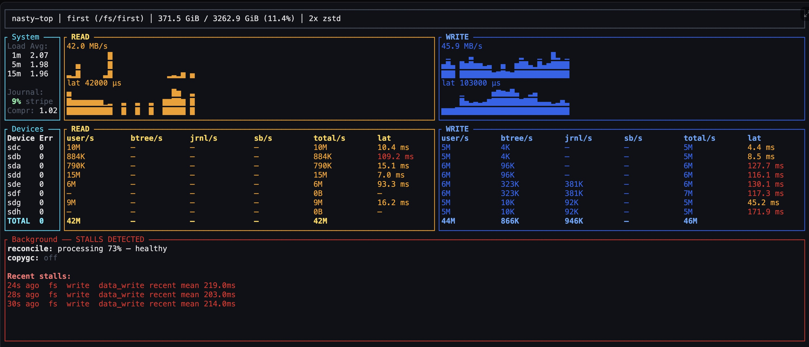

# nasty-top

A top-like TUI for bcachefs filesystems. Real-time per-device IO, latency, and internal stats with built-in tuning advisor.

Built for [NASty](https://github.com/nasty-project/nasty) but works on any system with a mounted bcachefs filesystem.



## Features

- **Live IO throughput and latency** per device with user/btree/journal/sb breakdown
- **Latency from bcachefs time_stats** (EWMA rolling mean, not useless cumulative averages)
- **Per-device IO breakdown** using `io_done` JSON and `io_latency_stats_*_json`
- **Blocked stats view** showing what's actually blocking IO right now (allocator, journal, write buffer, etc.)
- **Stall detection** with 60-second event log when latency exceeds 200ms
- **Tuning advisor** that analyzes current state and proposes sysfs changes with one-key apply
- **Options panel** with inline editing of runtime-tunable sysfs options
- **Configuration markers** for A/B comparison of settings
- **Process IO view** showing which processes are doing IO
- **Journal fill %**, load average, reconcile progress
- **Consistent color scheme**: yellow = read, blue = write, red = errors/stalls

## Install

**Homebrew (Linux):**
```bash
brew install fenio/tap/nasty-top
```

**Download binary:**
```bash
curl -sL https://github.com/nasty-project/nasty-top/releases/latest/download/nasty-top-x86_64-linux.tar.gz | \
  sudo tar xzf - -C /usr/local/bin/
```

**Build from source:**
```bash
cargo install --path .
# or cross-compile from macOS:
brew install filosottile/musl-cross/musl-cross
rustup target add x86_64-unknown-linux-musl
./deploy.sh root@your-nas
```

## Usage

```
nasty-top [OPTIONS]

Options:
  -f, --filesystem <NAME|UUID>  Filesystem to monitor (default: first found)
  -t, --interval <SECONDS>      Refresh interval (default: 2)
  -h, --help                    Print help
```

## Keybindings

| Key | Action |
|-----|--------|
| `o` | Toggle options panel (hidden by default) |
| `r` | Toggle reconcile on/off |
| `p` | Toggle process IO view |
| `t` | Toggle blocked stats view |
| `Tab` | Switch focus between metrics and options panel |
| `Enter` | Edit selected option value |
| `Esc` | Cancel edit |
| `m` | Save current options as a marker |
| `1`-`9` | Restore marker |
| `Y` | Apply advisor suggestion |
| `N` | Dismiss suggestion for 2 minutes |
| `!` | Permanently dismiss suggestion |
| `C` | Clear all permanent dismissals |
| `q` | Quit |

## Data Sources

| Metric | Source | Notes |
|--------|--------|-------|
| IO throughput | `dev-N/io_done` (JSON) | Per-type breakdown, diffed per tick |
| IO latency (device) | `dev-N/io_latency_stats_{r,w}_json` | EWMA mean, shown only when active |
| IO latency (fs) | `time_stats/data_{read,write}` | "recent" column rolling mean |
| Blocked stats | `time_stats/blocked_*` | Count delta per tick + recent mean |
| Journal fill | `internal/journal_debug` | dirty/total entries + watermark |
| Compression | `compression_stats` | compressed vs uncompressed bytes |
| Reconcile | `bcachefs reconcile status` | Subprocess, parsed for progress |
| Process IO | `/proc/<pid>/io` | read_bytes/write_bytes diffed |
| Options | `options/*` | Read/write directly to sysfs |

## Tuning Advisor

The advisor evaluates rules each tick and proposes sysfs changes. See [TUNING_RULES.md](TUNING_RULES.md) for the full rule set.

## License

GPL-3.0-only
