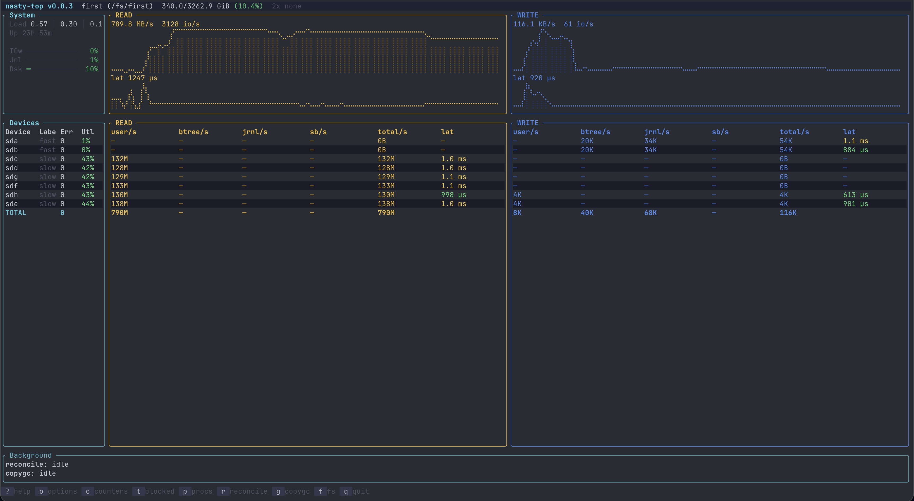
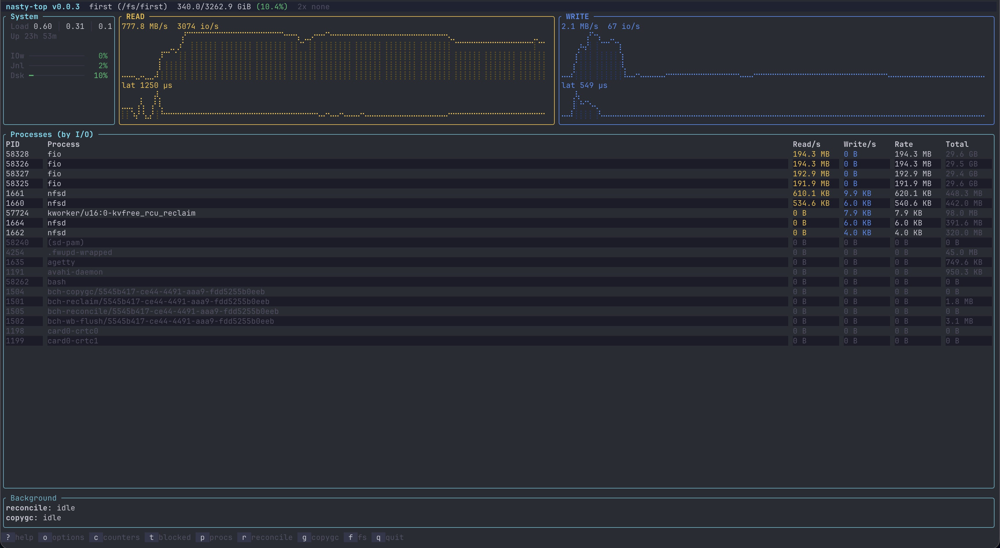
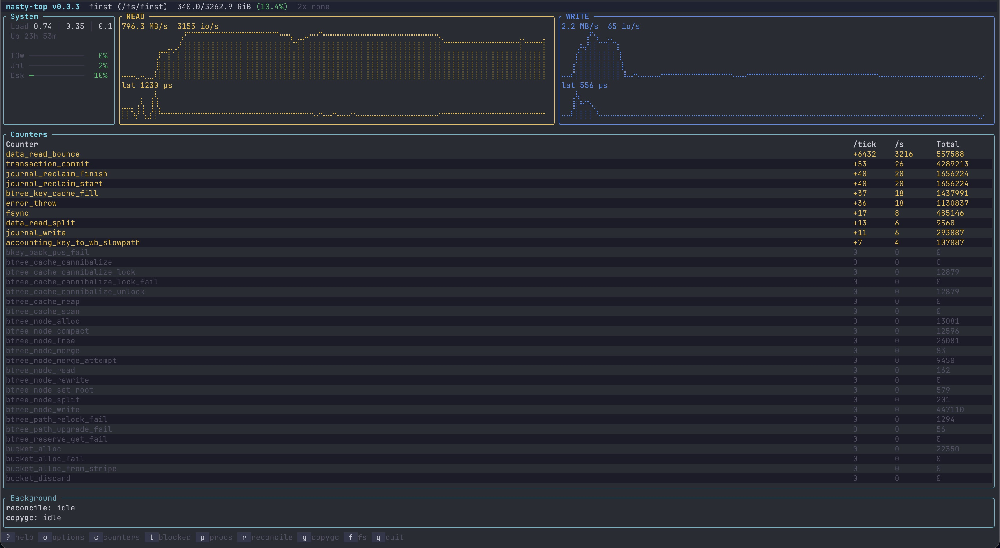

# nasty-top

A top-like TUI for bcachefs filesystems. Real-time per-device IO, latency, and internal stats with built-in tuning advisor.

Built for [NASty](https://github.com/nasty-project/nasty) but works on any system with a mounted bcachefs filesystem.





## Features

- **Live IO throughput and latency** per device with user/btree/journal/sb breakdown
- **Latency from bcachefs time_stats** (EWMA rolling mean, not useless cumulative averages)
- **Per-device IO breakdown** using `io_done` JSON and `io_latency_stats_*_json`
- **Per-device queue diagnostics** with current/average queue depth, IOPS, block await, utilization, and pressure outlier highlighting
- **Large-pool navigation** with synchronized device-table scrolling and worst-pressure-first sorting
- **Blocked stats view** showing what's actually blocking IO right now (allocator, journal, write buffer, etc.)
- **Stall detection** with 60-second event log when latency exceeds 200ms
- **Evidence-based advisor** (`a`) with time-windowed I/O, journal and device-health findings, supporting measurements, and investigation guidance
- **Options panel** with inline editing of runtime-tunable sysfs options
- **Multi-filesystem support** — press `f` to cycle between mounted bcachefs filesystems
- **Process IO view** showing which processes are doing IO
- **Journal fill %**, load average, reconcile progress
- **Memory pressure context** with host RAM, available RAM, kernel-reclaimable memory, and the selected filesystem's btree-node cache
- **Target capacity / GC pressure view** (`v`) with eligible members, raw capacity, free buckets, metadata footprint/backlog, and per-member allocation details
- **Metadata placement diagnostics** for oversized footprints, insufficient replica members, and unequal-size replica-layout constraints; missing metrics remain explicitly unknown
- **Outstanding I/O detection** after 30 seconds without observed completions, including discard/flush progress where available
- **Journal bottleneck classification** distinguishing space, completion, pipeline, metadata-reclaim and write-buffer pressure
- **Active error and member-state alerts** with separate error categories, UUID-based histories, recovery/stale states, and multi-device error correlation
- **Session-aware error counts**: the device Err column dims pre-existing counts and turns bold red only when errors grow during the current run — so you can tell at a glance whether a number is dead history or actively climbing
- **Consistent color scheme**: yellow = read, blue = write, red = errors/stalls

## Install

**Nix:**
```bash
nix run github:nasty-project/nasty-top
```

**Homebrew (Linux):**
```bash
brew install fenio/tap/nasty-top
```

**Download binary:**
```bash
curl -sL https://github.com/nasty-project/nasty-top/releases/latest/download/nasty-top-x86_64-linux.tar.gz | \
  sudo tar xzf - -C /usr/local/bin/
```

**Build from source:**
```bash
cargo install --path .
# or cross-compile from macOS:
brew install filosottile/musl-cross/musl-cross
rustup target add x86_64-unknown-linux-musl
./deploy.sh root@your-nas
```

## Usage

```
nasty-top [OPTIONS]

Options:
  -f, --filesystem <NAME|UUID>  Filesystem to monitor (default: first found)
  -t, --interval <SECONDS>      Refresh interval (default: 2)
  -h, --help                    Print help
```

## Keybindings

| Key | Action |
|-----|--------|
| `?` | Toggle help popup |
| `o` | Toggle options panel (hidden by default) |
| `c` | Toggle counters view |
| `t` | Toggle blocked stats / time_stats view |
| `p` | Toggle process IO view |
| `v` | Toggle target capacity / GC pressure view |
| `a` | Toggle Advisor findings and evidence view |
| `s` | Toggle pressure / filesystem device ordering |
| `r` | Toggle reconcile on/off |
| `g` | Toggle copygc on/off |
| `f` | Cycle between filesystems |
| `Tab` | Switch focus between metrics and options panel |
| `↑`/`k`, `↓`/`j` | Scroll devices or the active detail view (including Targets and Advisor) |
| `Enter` | Edit selected option value (in options panel) |
| `Esc` | Cancel edit / dismiss status message |
| `N` | Mute current hint for 2 minutes |
| `!` | Never show this hint again |
| `C` | Clear all permanent mutes |
| `q` / `Ctrl-C` | Quit |

## Data Sources

| Metric | Source | Notes |
|--------|--------|-------|
| IO throughput | `dev-N/io_done` (JSON) | Per-type breakdown, diffed per tick |
| IO latency (device) | `dev-N/io_latency_stats_{r,w}_json` | EWMA mean, shown only when active |
| Queue depth / await / IOPS / utilization | `/proc/diskstats` | Read once per tick, with a common monotonic timestamp; optional discard and flush completion counters |
| IO latency (fs) | `time_stats/data_{read,write}` | "recent" column rolling mean |
| Blocked stats | `time_stats/blocked_*` | Count delta per tick + recent mean |
| Journal entry occupancy (`JEnt`) | `internal/journal_debug` | Dirty/total entries, watermark and sequence positions; not disk journal-space usage; `?` when unavailable |
| Device error categories | `dev-N/io_errors` | Lifetime section only, without double-counting the since-reset section |
| Member identity / state | `dev-N/{uuid,state,block}` | UUID preferred; index/name fallback; state transitions and online status |
| Btree-node cache | `btree_cache_size` | Kernel-reported main buffers; approximate and not total bcachefs RAM |
| Host memory | `/proc/meminfo` | Used, available, and kernel-reclaimable memory |
| Reconcile | `bcachefs reconcile status` | Subprocess, parsed for progress |
| Reconcile backlog | Same status output | Data and metadata columns retained separately |
| Target membership / eligibility | `options/*_target`, `dev-N/{label,state,durability,data_allowed,block}` | Hierarchical labels or resolved device paths; non-writable/ineligible members excluded |
| Member capacity / allocation | `dev-N/{nbuckets,bucket_size,alloc_debug}` | Member capacity, free buckets, btree and fragmented bytes; refreshed every 10s or on observed membership/state/options changes |
| On-disk metadata footprint | `internal/alloc_debug` | Btree sectors converted to bytes; already includes physical replicas |
| GC pressure | `internal/copy_gc_wait` | Running state and sign of each member's calculated wait; refreshed each tick |
| Process IO | `/proc/<pid>/io` | read_bytes/write_bytes diffed |
| Options | `options/*` | Read/write directly to sysfs |

## Tuning Hints

When a constraint or pressure signal fires, a hint appears in the footer. Press **`a`** for all findings, evidence, first/last observation times, and active/resolved/stale status; **`v`** shows target capacity details. Observed events are distinguished from possible causes. Muting one hint reveals the next eligible hint; dismissals are scoped to the filesystem for the current run and do not hide evidence from the detail views.

The advisor uses up to 60 seconds of valid, timestamped evidence. Missing samples, counter resets, device replacement, and long collection gaps break continuity instead of producing false spikes or extended stall durations. Slow EWMA values only contribute to journal diagnoses when the corresponding operation count advances. The old blanket recommendations to flush more often or increase reserves have been replaced with investigation guidance.

For example, a metadata target with **2.82 TiB** of eligible member capacity and a reported **3.64 TiB** physical btree footprint is flagged, together with its metadata-placement backlog. The view also names members whose kernel GC-pressure signal is non-positive. It reports constraints rather than claiming to prove a reconcile deadlock.

Raw capacity is an upper bound before reserves, journals and other data. Free buckets are not guaranteed allocatable space (cached/fragmented space is different). Targets are best-effort, may overlap, and data-target options are filesystem defaults, not a survey of per-file overrides. Unknown/unsupported sysfs formats display `?`; they do not imply zero capacity. See [TUNING_RULES.md](TUNING_RULES.md) for the rules and estimation limits.

## License

GPL-3.0-only
